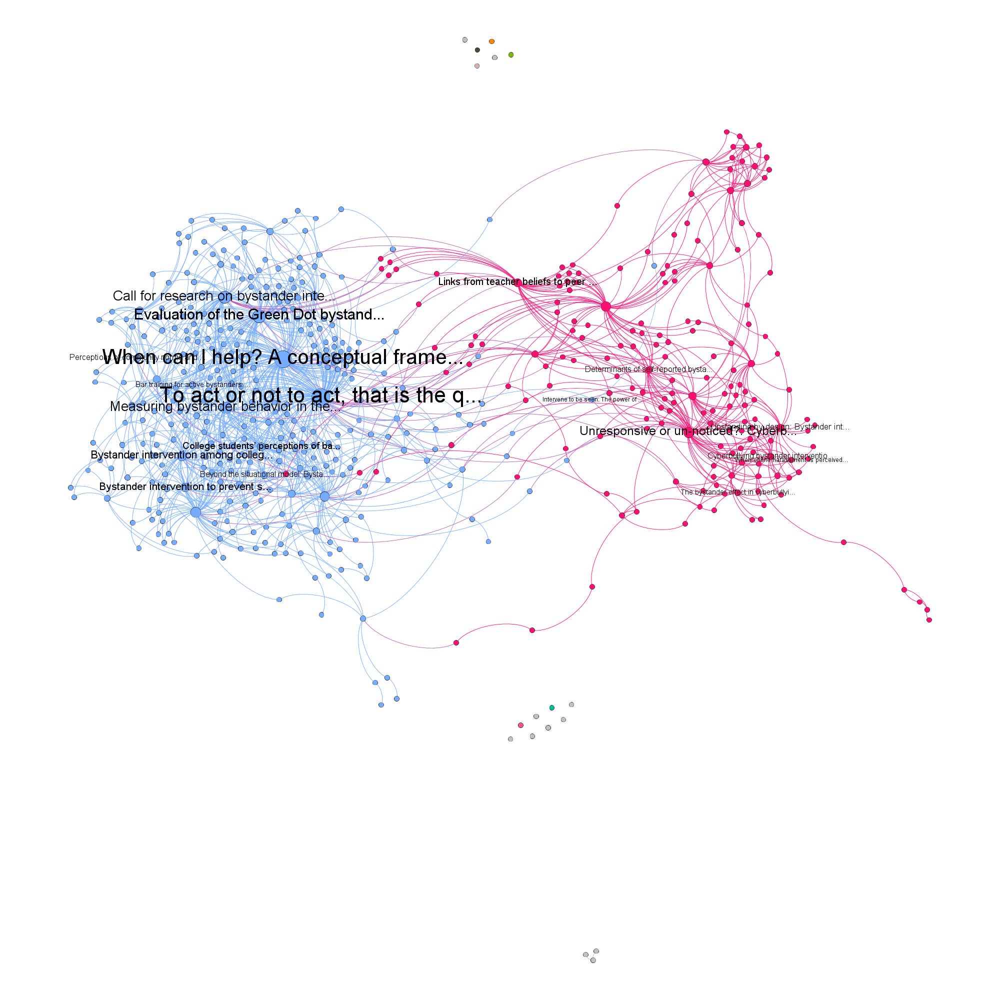
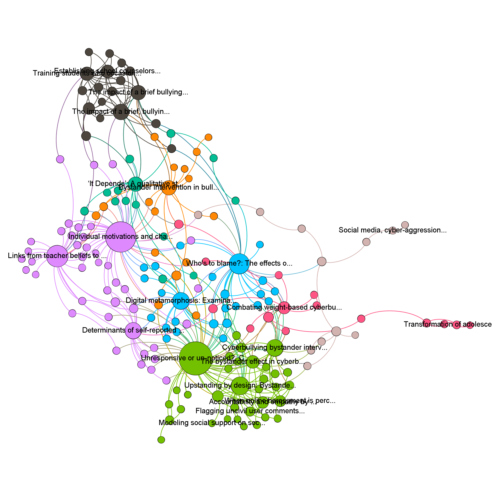

# Bystander Intervention Research

This directory contains some data collected to visualize some Google Scholar searches created with [etudier](https://github.com/edsu/etudier).

## search-01

**query**: "bystander intervention" AND "social media"  
**url**: https://scholar.google.com/scholar?hl=en&as_sdt=0%2C21&q=%22bystander+intervention%22+AND+%22social+media%22&btnG=  
**options**: --pages 20 --depth 1

* [GEXF file](search-01.gexf)
* [Gephi Project](search-01.gephi)
* [Nodes CSV](search-01-nodes.csv)
* [Edges CSV](search-02-edges.csv)

In this image (the "social" workbook in the above Gephi project), only nodes with *degree > 1* are shown. You can see that the modularity score assigned by Gephi partitions our results into two big groups. It looks as if the blue one is the bystander intervention research and the red one is related to social media and bystander intervention. 

The following visualization has isolated the social media posts from the previous image, and then generated a new modality score to see the communities within it.

## search-02

**query**: "bystander intervention" AND "social media" AND "race"  
**url**: https://scholar.google.com/scholar?hl=en&as_sdt=0%2C21&q=%22bystander+intervention%22+AND+%22social+media%22+AND+%22race%22&btnG=  
**options**: --pages 20 --depth 1

## Notes

These were notes from Melissa about how to conduct the literature review.

1. intitle:"bystander intervention" AND (intext:"racism" OR "anti-Blackness" OR "anti-Black")
2. intitle:"bystander intervention" AND (intext:"social media" OR “Twitter" OR "Reddit")
3. intext:"bystander intervention theory" OR "theory of bystander intervention"
4. intext:"bystander intervention theory" OR "theory of bystander intervention" AND "social media"
5. intext:"bystander intervention theory" OR "theory of bystander intervention" AND "internet"
6. intext:"bystander intervention theory" OR "theory of bystander intervention" AND "racism"
7. intitle:"bystander intervention" intext:"internet"
8. intitle:"bystander intervention" intext:"cyberbullying" OR "cyber bullying"
9. intitle:"bystander intervention" intext:"hate speech"
10. intitle:"bystander intervention" intext:"public health" AND "racism"
11. intext:"bystander intervention" AND "cyberbullying" AND "racism" AND "social media"
12. intext:"bystander intervention" AND "cyberbullying" AND "racism" AND "Twitter"
13. intext:"bystander intervention" AND "cyberbullying" AND "anti-Blackness"

In addition to search terms below, use "Related Articles" or "Cited By" for frequently cited pieces to identify if other citations have relevance based on the above key terms.

Repeat above with Brookings Library database or a university library database; "intitle"/"intext" qualifiers may not be applicable.

Exclude:
- Dissertations or Theses
- Non-academic articles or books (unless published by research organizations similar to Brookings)
